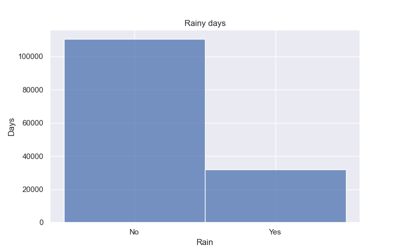
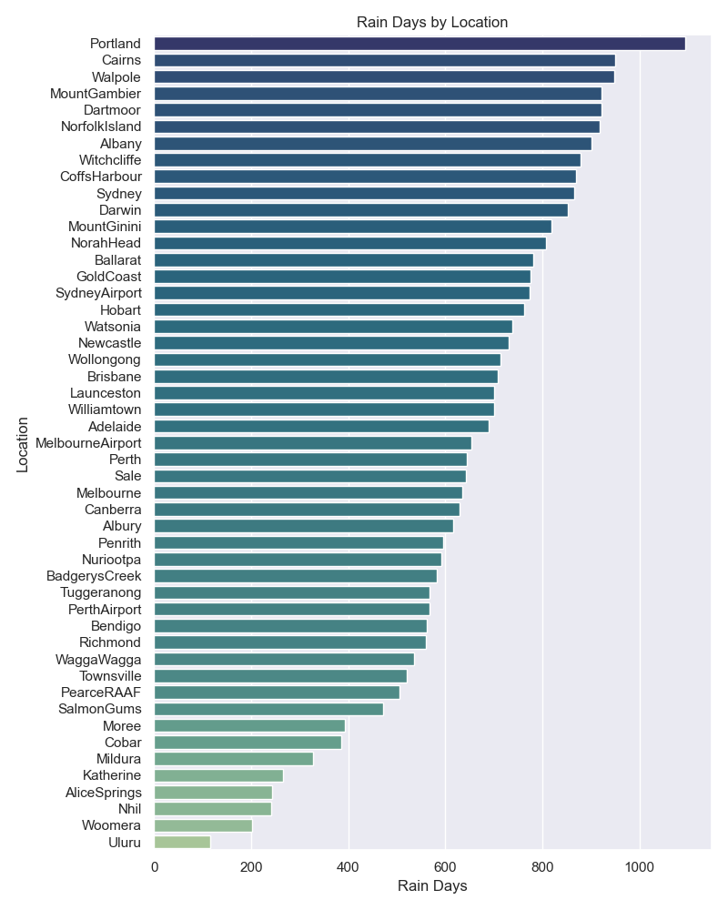

# Rain in Australia Prediction

## Introduction & Context
This is the last activity of the subject 02.584 - Data Mining from the Data Science Master's at UOC. In this project we are required to identify and define a business requirement for which we will perform some data analysis, data preprocessing and apply basic ML algorithms. 

Knowing whether or not it will rain the next day is vital for many companies working in the more rural areas of Australia. On the one hand, in the southern regions where most of the rainfall is found, it is essential for farm workers to know for sure whether or not it will rain the next day in order to leave the field ready for the following day. On the other hand, the northern and north-western regions, where many mining companies have camps and carry out their mining activities in these areas. For these companies it is important to know if there will be rainfall the following day, as this hinders mining activities, especially in open-pit mines. Hence, this project intends to predict wether or not the next day is going to rain or not.

## Dataset

The data with which we will work contain daily meteorological information of the last 10 years of the Austrian territories. We have continuous variables such as humidity levels, maximum temperature, minimum temperature, etc. We also have categorical variables such as territory and wind direction, and binary variables. The data have been extracted from Kagle (https://www.kaggle.com/datasets/jsphyg/weather-dataset-rattle-package/data) and at the moment these are fed from the Australian weather website (http://www.bom.gov.au/).

The data we have are raw, and therefore a previous cleaning will be necessary before processing them and applying the model. Therefore, before applying our classification model, we will have to deal with blank spaces, null values, outliers and other facts that may appear. In both supervised and unsupervised models it is important to treat outliers correctly as they can bias the results towards false conclusions. However, it is worth mentioning that we have models that are not affected by outliers, as is the case of the forest of openings in classification models and the DBSCAN algorithm for unsupervised models.

We present the columns of the set of data.

- **Date:** Date of the observation.
- **Location:** Location of the meteorological station.
- **MinTemp:** Minimum temperature (Celsius).
- **MaxTemp:** Maximum Temperature (Celsius)
- **Rainfall:** Amount of rainfall collected that day (mm)
- **Evaporation:** Evaporation class A (mm) For more information: https://en.wikipedia.org/wiki Pan_evaporation
- **Sunshine:** Hours of sunshine per day.
- **WindGustDir:** The direction of the strongest wind gust in the last 24 to midday.
- **WindGustSpeed:** The speed of the strongest wind gust in the last 24 hours until midday (km/h).
- **WindDir9am:** Wind direction at 9am.
- **WindDir3pm:** Wind direction at 3pm.
- **WindSpeed9am:** Wind speed averaged for 10 minutes before 9am (km/h).
- **WindSpeed3pm:** Wind speed forecasted for 10 minutes before 3pm (km/h)
- **Humidity9am:** Humidity at 9am (%).
- **Humidity3pm:** Humidity at 3pm (%).
- **Pressure9am:** Atmospheric pressure reduced at sea level at 9am (hPa).
- **Pressure3pm:** Reduced atmospheric pressure at sea level at 3pm (hPa)
- **Cloud9am:** Cloud-covered sky fraction at 9am (oktas*).
- **Cloud3pm:** Cloud cover at 3pm (oktas).
- **Temp9am:** Temperature at 9am (Celsius).
- **Temp3pm:** Temperature at 3pm (Celsius).
- **RainyToday:** Categorical variable that indicates if it has rained today or not.
- **RainyTomorrow:** Categorical variable indicating whether it will rain the next day or not.
 

## Exploratory Data Analysis
In this section we will go thorugh some analysis on the data. 

**Observations:**
- As observed, non rainy days are more often than rainy days. In this case, roughly 80% of the dataset are non rainy days.
- From here we can sense the presence of unbalanced data. 

We proceed to analyze how the different numerical attriubtes distribute. 

**Observations:**
- Most of the variables follow a normal distribution.
- Rainfall variable appear to have some issues when ploting, most likely due to the presence of outliers. Outliers may also be affecting Evaporation as it appears skewed in the plot.
- Due to Australia's variety of climates, we can see wide ranges in MinTemps and MaxTemps. Territories such as Victoria, are usually colder than tropical territories like Northern Territory. Therefore, these differences of climates across regions make the distributions much wider.
- Humidity columns presnet also a curious distribution with peaks of humidity to 100% at 9am. 

How rain distributes across Locations can be useful to identify which regions are more rainy. 

**Observations:**
- As observed, Portland is the city with most Rainy days over the last years and Uluru presents the lowest rain levels of all locations.
- This chart provides us with the sense that Location may be a very relevant feature when making predictions. 

It is also interesting to analyze the rain distribution from a time perspective.

**Observations:**
- As it can be observed in the first graph, rainy days have slightly decreased since 2007 and has mantained a rain rate around 20% and 24% over the last years. 

- The second plot suggests that rain in australia has a certain degree of seasonality. Rain days are more common between May and September, and they drop after October. This seasonality can strongly be noted in northern regions, where they experience a dry and wet season.

Lastly, it is  good idea to see how the variables correlate with each other. 

**Observations:**
- With this graph we are able to see the correlations between variables. We observe strong positive correlations and relatively strong negative correlations.
- Temperatures are highly correlated with their correlative variables. For instance, Temp9am is strongly correlated with MinTemp (0.9) an Temp3pm with MaxTemp (0.98).
- As for negative strong correlations, Cloud9am and Cloud3pm outstand from the rest. These two variables are strongly correlated with Sunshine (0.68 and 0.7 respectively) suggesting that the presence of clouds at 9am and 3pm reduce Sunshine.

## Modelling

## Results
